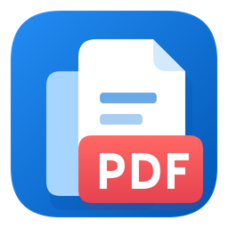

<p align="center">
  
</p>

<h1 align="center">Office 资料一键合并 PDF (Office PDF Merger)</h1>

<p align="center">
  <b>面向 Windows 的轻量、快速、纯本地 Office 资料与多媒体一键合并 PDF 工具</b>
</p>

<p align="center">
  
  
  
  
</p>

---

## 📖 项目简介

**Office 资料一键合并 PDF** 是一款专为 Windows 平台打造的本地桌面工具。可将散乱的 Word、PowerPoint、图片、单页/多页 PDF 资料，按照用户自定义的顺序一键合并为标准 PDF 文件或按分组分类归集。

本工具采用 **WPF 现代界面 + 后台独立 Worker 进程** 的解耦架构，界面响应迅速，支持任务进度恢复，不锁死主线程，且全程纯离线本地转换，保障资料隐私安全。

---

## ✨ 核心特性

- **多源异构文件一键合并**：支持 Word (`.docx`, `.doc`)、PowerPoint (`.pptx`, `.ppt`)、常见图片 (`.jpg`, `.png`, `.bmp`, `.tiff` 等) 以及现存 PDF。
- **后台独立 Worker 进程**：
  - 任务调度与界面完全解耦，转换在后台独立 `OfficePdfWorker.exe` 中进行。
  - 关闭主窗口后转换任务不中断；重新启动主程序可无缝恢复进度或取消任务。
- **健壮的文件名与重名避让**：
  - 完整保留带多版本点号或序号的复杂文件名（如 `18.1-杨某某（CV、GCP、执业证书）`），杜绝因误判扩展名导致的截断。
  - 自动检测目标同名文件并智能附加 `(2)`、`(3)` 等递增序列编号，绝不覆盖源文件。
- **清单与日志集中归档**：
  - 转换过程中生成的 `.清单.csv` 和 `.日志.txt` 统一收纳在程序根目录下的 `OfficePdfData` 文件夹中。
  - 用户选定的目标输出文件夹仅保存合并后的最终 PDF，保持目录整洁清爽。
- **现代化矢量与高 DPI 适配**：
  - 采用现代扁平风格窗口与统一设计语言，提供包含 16x16 至 256x256 全尺寸的原生应用图标，支持高分屏自适应。
- **纯本地运行与依赖随附**：
  - 内置经过官方 SHA-256 哈希校验的 `qpdf 12.4.1` 核心组件，无需终端用户另行下载或配置环境变量。

---

## 📂 仓库目录结构

```text
office_pdf_gui_v1.4.3/
├── .gitattributes                # Git 换行符与二进制文件属性配置
├── .gitignore                    # 忽略编译产物、Release 输出及临时文件
├── LICENSE                       # MIT 开源许可证
├── README.md                     # GitHub 仓库首页说明文档
├── build.ps1                     # 自动化编译脚本（基于 .NET Framework csc.exe）
├── package.ps1                   # 发布打包脚本（自动校验哈希并生成发布 Zip）
├── assets/                       # 应用图标与矢量视觉资源
│   ├── OfficePDF.ico             # 包含多尺寸的多分辨率 Windows 图标
│   ├── OfficePDF.png             # 高清栅格图标
│   ├── OfficePDF.svg             # 原始矢量源文件
│   ├── OfficePDF-master.png      # 1024x1024 高清主图
│   └── icon-preview.png          # 图标预览图
├── docs/                         # 项目文档
│   ├── 使用说明.md               # 终端用户使用指南
│   └── 验证报告_v1.4.3.md        # 版本验收与测试报告
├── src/                          # 核心源码 (C# 5.0 / WPF)
│   ├── AssemblyInfo.cs           # 程序集元数据与版本定义
│   ├── Conversion.cs             # 核心转换逻辑（Office COM 调用、图像转 PDF）
│   ├── Engine.cs                 # 基于 qpdf 的 PDF 合并与引擎封装
│   ├── FolderPicker.cs           # 现代化文件夹选择器
│   ├── MainWindow.xaml           # WPF 主界面布局
│   ├── ModernWindow.cs           # 现代化无边框窗体交互逻辑
│   ├── Models.cs                 # 数据模型与任务定义
│   ├── Program.cs                # GUI 应用程序入口
│   ├── RuntimeFiles.cs           # 随附 qpdf 运行组件完整性校验
│   ├── Scheduler.cs              # 后台任务调度与状态同步
│   ├── WorkerProgram.cs          # 后台 Worker 进程入口
│   └── app.manifest              # 启用视觉样式与 DPI 感知配置
├── tests/                        # 自动化测试工程
│   ├── fixtures/                 # 独立的精简测试样例集
│   ├── test_v143_fixes.ps1       # 核心业务逻辑与回归测试脚本
│   ├── verify_package.py         # 发布包 SHA256 与文件完整性校验脚本
│   ├── verify_resources.py       # PE 文件与图标资源校验脚本
│   └── VerifyIcon.cs             # 窗口与任务栏原生图标句柄提取与校验
├── THIRD_PARTY_LICENSES/         # 第三方随附组件开源许可证
│   ├── GCC-GPLv3.txt             # GCC 运行时 GPLv3
│   ├── GCC-Runtime-Exception.txt # GCC 运行时例外许可
│   ├── mingw-w64-COPYING.txt     # MinGW-w64 运行库许可
│   ├── qpdf-LICENSE.txt          # qpdf Apache 2.0 许可证
│   ├── qpdf-NOTICE.md            # qpdf 官方声明
│   ├── README.txt                # 第三方组件说明
│   └── winpthreads-COPYING.txt   # WinPthreads 许可
├── tools/                        # 辅助构建与诊断工具
│   ├── make_icon.ps1             # 矢量 SVG 编译为多尺寸 ICO 脚本
│   ├── make_icon.py              # 多分辨率 PNG 组装为 ICO 的 Python 脚本
│   ├── RenderIcon.cs             # 基于 WPF 渲染矢量图为指定尺寸位图
│   └── 收集诊断信息.ps1          # 客户端一键诊断与安全软件隔离排查脚本
└── vendor/                       # 第三方二进制压缩归档
    └── qpdf-12.4.1-mingw64.zip   # 官方 qpdf 二进制包
```

---

## 🛠️ 环境要求

### 开发与编译环境
- **操作系统**：Windows 10 / Windows 11 (x64)
- **编译工具**：Windows 内置的 `.NET Framework 4.0+ csc.exe`（无需安装庞大的 Visual Studio，开箱即编）
- **PowerShell**：PowerShell 5.1 或 PowerShell 7+

### 运行环境
- **Word / PPT 转 PDF**：依赖本机安装有 Microsoft Office（Office 2013 / 2016 / 2019 / 2021 / Microsoft 365 均可）。
- **图片与 PDF 合并**：纯本地原生代码 + 随附 `qpdf`，**无需** 安装 Microsoft Office 或其他任何第三方软件。

---

## 🚀 编译与构建

克隆仓库后，在项目根目录运行 `build.ps1` 即可完成一键构建：

```powershell
.\build.ps1
```

构建脚本会自动执行：
1. 校验（或自动下载）`vendor\qpdf-12.4.1-mingw64.zip` 的官方 SHA-256 哈希值；
2. 提取必要的 `qpdf.exe`、`qpdf30.dll` 等运行组件到 `qpdf/` 目录；
3. 编译后台工作进程 `OfficePdfWorker.exe`；
4. 嵌入矢量图标与 XAML 资源，编译主程序 `Office资料一键合并PDF_v1.4.3.exe`。

---

## 📦 打包与交付

如需生成供终端用户直接解压即用的免安装绿色发布包，请运行：

```powershell
.\package.ps1 -Force
```

脚本将会在项目根目录生成 `成品/` 目录，并在上级目录打包输出：
- `OfficePDF_v1.4.3_x64.zip`
- `交付包SHA256.json`

---

## 🧪 运行自动化测试

项目随附了完整的回归与合规性测试套件：

```powershell
# 运行功能修复与重名避让测试
pwsh -File .\tests\test_v143_fixes.ps1

# 运行 PE 资源与多尺寸图标完整性校验（需要 Python + Pillow + pefile）
python .\tests\verify_resources.py
```

---

## 🔍 故障排查与诊断

如果终端用户在特定环境中遇到被 Windows Defender / 杀毒软件误拦截或后台任务中断，可运行：

```powershell
pwsh -File .\tools\收集诊断信息.ps1 -ProgramDirectory "D:\Path\To\Program"
```

该脚本将安全地收集 Defender 隔离记录、关联进程状态并输出诊断报告（不执行文件、不修改安全设置、不上传隐私）。

---

## 📄 开源许可证

本项目源码基于 [MIT License](LICENSE) 开源。

项目中打包随附的二进制组件遵循其各自的开源许可协议：
- **qpdf**：[Apache License 2.0](THIRD_PARTY_LICENSES/qpdf-LICENSE.txt)
- **GCC Runtime Libraries**：[GPLv3 with Runtime Library Exception](THIRD_PARTY_LICENSES/GCC-Runtime-Exception.txt)
- **MinGW-w64 Runtime**：[MinGW-w64 License](THIRD_PARTY_LICENSES/mingw-w64-COPYING.txt)
